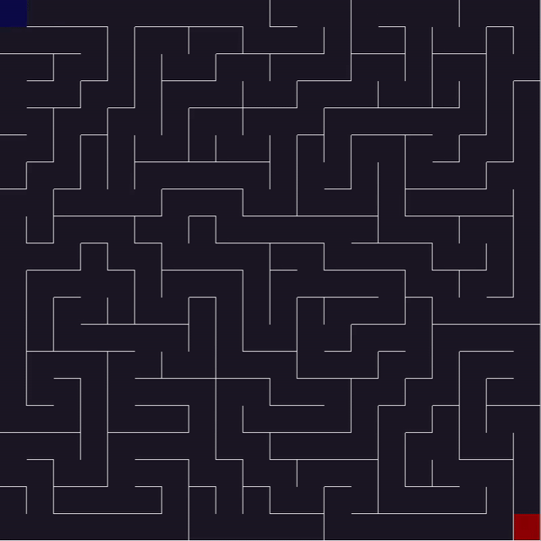
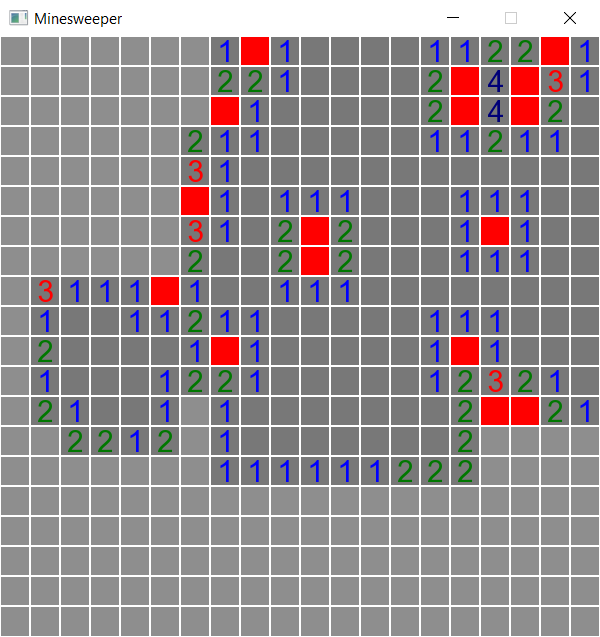
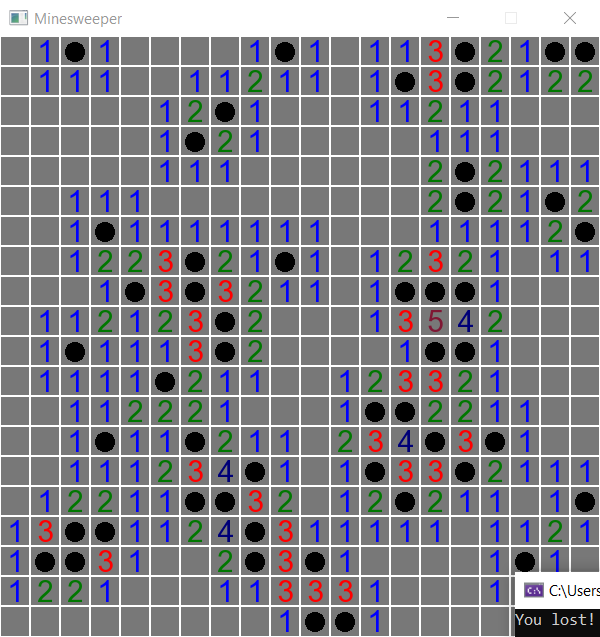

# Logic calculator

## General info

This is a C++ program that converts given logic formula to its postfix representation (shunting yard algorithm) and then prints calculated result/s.

## How to Use

### Write a logic formula with up to 3 variables (p, q, r).

### Don't use spaces! Use only those characters:

* `0`
* `1`
* `p`
* `q`
* `r`
 

* `~` - negation
* `v` - disjunction
* `^` - conjunction
* `I` - implication 
* `E` - equivalence
 

* `(`
* `)`

## Examples:

Input
<pre>0v0E1^1</pre>

Output:
<pre>Result: 0</pre>

Input
<pre>~pEqE(~(pIq)^(qIp))</pre>

Output
<pre>
| p | q | result
| 0 | 0 | 1
| 0 | 1 | 0
| 1 | 0 | 1
| 1 | 1 | 1
</pre>

# Maze game

## General info

This is a C++ program that generates a maze using an iterative implementation of depth-first search algorithm and then lets user play a maze game.

## Keyboard Controls

* `LEFT` - move left
* `RIGHT` - move right
* `UP` - move up
* `DOWN` - move down
* `ESC` - exit

## Example gameplay

 

# Minesweeper

## General info

This is just a minesweeper in C++.

## Controls

* `LMB` - reveal a cell/s
* `RMB` - mark a cell
* `ESC` - exit

## Screenshots

 

  
  

